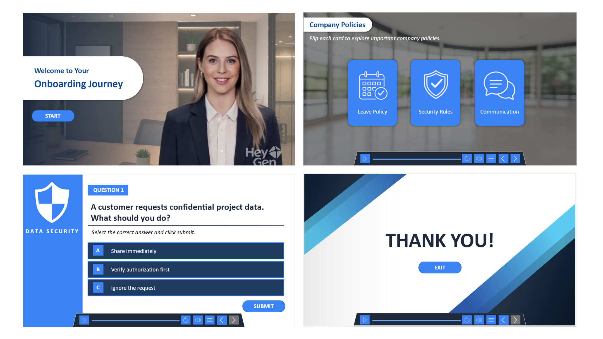

  

Senior eLearning Developer with 9+ years of experience creating engaging digital learning solutions by combining Articulate Storyline 360, Rise 360, AI-powered tools, interactive media, SCORM/xAPI standards, and modern learning technologies.

---
---

# 🌟 Latest Featured Project

## AI-Powered Employee Onboarding Experience

A modern onboarding experience developed using Articulate Storyline 360 and AI-powered content creation tools.

### Project Highlights

* AI-generated presenter video using HeyGen
* Interactive flip-card learning activities
* Scenario-based workplace decision making
* Modern custom Storyline 360 interface
* AI-generated visual assets and backgrounds

### Tools Used

Storyline 360 • HeyGen • AI Image Generation • Interactive Learning Design

### Explore the Project

📖 **Project Details:**
[View Full Case Study](./projects/ai-onboarding-storyline/)

🚀 **Interactive Demo:**
[Launch Course](https://360.articulate.com/review/content/5c9bc88b-e947-4987-9a34-5d22e380347b/review)

---

# 🎯 Featured Projects

| Project | Description | Live Demo |
|---|---|---|
| AI-Powered Employee Onboarding Experience | Modern onboarding module featuring an AI-generated presenter, interactive flip cards, company policy exploration, scenario-based learning, and custom Storyline 360 UI design. | [Launch Course](https://360.articulate.com/review/content/5c9bc88b-e947-4987-9a34-5d22e380347b/review) |
| Gamified Service Portfolio Experience | Custom gamified eLearning module developed in Articulate Storyline 360 with dynamic timer logic, skill points, hint-based interactions, and futuristic custom GUI design. | [Launch Course](https://360.articulate.com/review/content/9cf1b324-e79c-427b-918d-594dfbcb6f0a/review) |
| eLearning Demo | Interactive multimedia eLearning showcase module | [Launch Course](https://nareshgandi999.github.io/naresh-elearning/projects/elearning-demo/story.html) |
| Cancer Clinical Care Pathways | Interactive healthcare learning experience with scenario-based training | [Launch Course](https://nareshgandi999.github.io/naresh-elearning/projects/cancer-clinical-care-pathways/story.html) |
| Cost Management Accounting | Interactive accounting and finance learning module | [Launch Course](https://app.cloud.scorm.com/sc/InvitationConfirmEmail?publicInvitationId=2696f3e0-f52b-42ff-9e29-92243ff2f734) |
| Front Desk Assistant | Software simulation module for customer interaction workflows | [Launch Course](https://app.cloud.scorm.com/sc/InvitationConfirmEmail?publicInvitationId=1d2d7b55-65e9-449e-87d9-f80cb0d4619a) |
| Sexual Harassment Awareness | Compliance training module with interactive assessments | [Launch Course](https://app.cloud.scorm.com/sc/InvitationConfirmEmail?publicInvitationId=ad105b44-d86e-4e25-afe0-00efe478339c) |
| Software Simulation Course | Interactive guided simulation with system walkthroughs | [Launch Course](https://nareshgandi999.github.io/naresh-elearning/projects/software-simulation-course/story.html) |
| How to Bake a Cake | Interactive learning demo with multimedia elements | [Launch Course](https://nareshgandi999.github.io/naresh-elearning/projects/how-to-bake-a-cake/story.html) |

---

# 🛠 Authoring Tools

- Articulate Storyline 360
- Rise 360
- Lectora

# 🎨 Multimedia Tools

- Camtasia
- Adobe Photoshop
- Adobe Illustrator
- Adobe Animate

# 📚 Learning Standards

- SCORM 1.2 / 2004
- xAPI
- WCAG Accessibility
- LMS Deployment

# 🎯 Specializations

- Scenario-Based Learning
- Software Simulations
- Compliance Training
- Healthcare eLearning
- Accessibility-Focused Development
- Interactive Assessments
- Responsive Learning Experiences

---

# 📈 Experience Highlights

- 9+ years in eLearning development
- Expertise in Storyline 360 and Rise 360
- Experience with SCORM/xAPI publishing
- Interactive simulations and branching scenarios
- Multimedia-focused learning experiences

---

# 📬 Connect With Me

## 📬 Connect With Me

- 💼 LinkedIn: [linkedin.com/in/naresh-goud-789979107](https://www.linkedin.com/in/naresh-goud-789979107)
- 🌐 Portfolio: [nareshgandi999.github.io/naresh-elearning](https://nareshgandi999.github.io/naresh-elearning/)
- 📧 Email: [nareshgandi999@gmail.com](mailto:nareshgandi999@gmail.com)
